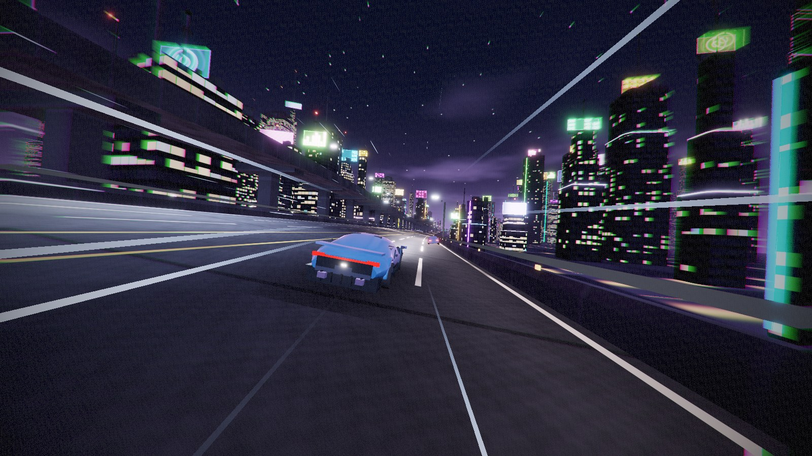

# Random HTML Games

Browser games that live in **one HTML file each**. No installs, no build step, no asset downloads —
open the file and it plays. Everything is generated at runtime in code.

### **[▶ Play them here](https://alekholt.github.io/random-html-games/)**

---

## Games

| Game | What it is | Built with | |
| --- | --- | --- | --- |
| **[Neon Run](neon-run/)** | Endless night-city highway racer with two drivable tiers of elevated expressway, procedural city and cars, and synthesised engine audio | WebGL · three.js | [▶ Play](https://alekholt.github.io/random-html-games/neon-run/) |

[](neon-run/)

---

## How this repo is laid out

```
random-html-games/
├── index.html          ← landing page listing every game
├── LICENSE
└── <game-name>/
    ├── index.html      ← the entire game, one file
    ├── README.md       ← controls, how it works
    └── screenshots/
```

Each game is fully self-contained in its own folder, so you can download a single `index.html`
and it still works. The root `index.html` is just an index that links to them.

### Adding a game

1. Drop it in a new folder as `<game-name>/index.html`, with its own `README.md` and `screenshots/`.
2. Copy an `<article class="card">` block in the root `index.html` and point it at the new folder.
3. Add a row to the table above.

## Running locally

```bash
git clone https://github.com/AlekHolt/random-html-games.git
cd random-html-games
python3 -m http.server 8000
```

Then open <http://localhost:8000/>. Individual games also work by opening their `index.html`
directly from the filesystem.

## License

MIT — see [LICENSE](LICENSE).
