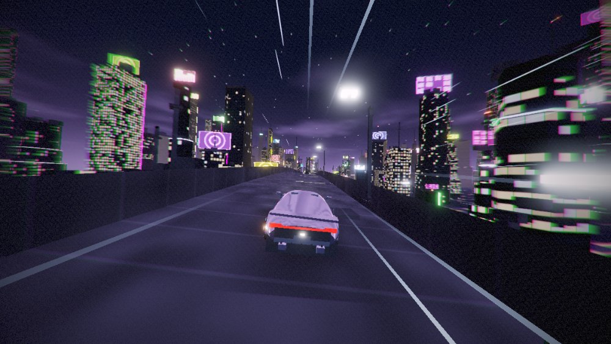
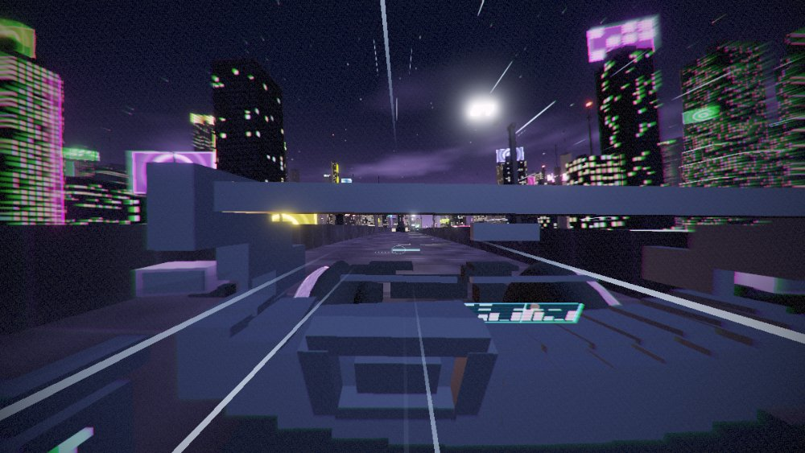

# Neon Run

*Part of [Random HTML Games](../README.md).*

An endless night-city driving game that runs in a single HTML file. No build step, no assets,
no engine — every road, building, billboard, car and sound is generated procedurally at runtime
by ~2,400 lines of JavaScript and GLSL on top of three.js.

**[▶ Play it](https://alekholt.github.io/random-html-games/neon-run/)** · or download `index.html` and double-click it.


## Controls

| Key | Action |
| --- | --- |
| `W` / `S` | Throttle / brake |
| `A` / `D` | Steer |
| `Space` | Handbrake (kills rear grip — this is how you drift) |
| `Shift` | Boost (refills on near misses) |
| `C` | Cycle camera — chase, close, hood, cockpit, cinematic |
| `R` | Restart run |
| `Tab` | Garage & settings |

No loading screen and no click-to-start: you begin mid-run at 190 km/h.

## What's actually generated

**The road** is an infinite spline integrated from layered-noise *curvature* rather than sampled
positions, so it stays C¹-continuous forever. It rides 5–31 m above the city on its own pillars.
Chunks stream in 240 m units and are disposed behind you; each one is built incrementally across
frames against a 2.4 ms budget so streaming never costs a frame.

**Two highway tiers.** Elevated expressways peel away from your carriageway on real, drivable
ramps: a 185 m merge zone opens a gap in the barrier and an extra lane appears beside you at road
level, then climbs ~16 m over the next 310 m. Take it and you're on the upper deck until the far
ramp brings you back down.



**The city** is lofted stacked prisms with setbacks, spires, rooftop rigs, gantries, overpasses and
animated neon billboards — merged per chunk into a handful of draw calls. Facades run a shader that
hashes lit windows per cell with derivative-based LOD, so distant towers dissolve into glow instead
of shimmering.

**The cars** are parametric lofts: cross-sections swept along the body with computed smooth normals,
wheel arches, clearcoat paint against a procedural PMREM night-sky environment map, and a full
futuristic cabin with animated displays and a yoke that turns with your input.



**The audio** is synthesised live — four detuned oscillators through a waveshaper for the engine,
filtered noise for wind and tyre scrub, all driven by RPM and slip. There are no sound files.

**The lighting** is analytic. Lamp pools and your own headlight cone are solved directly in the road
shader rather than being scene lights, which is why the whole frame costs ~110 draw calls and
~100k triangles.

## Sense of speed

Roughly ten independent cues stack up: dynamic FOV, a dithered 16-tap radial blur, world-wrapped
streak particles, rhythmic lamp pools and 8 m reflector posts strobing past, camera shake that
scales with velocity, oncoming traffic, chromatic aberration, and a grip-limited steering law where
full lock always equals maximum cornering and never more.

## Handling

Arcade drift physics on a bicycle model with a simplified Pacejka tyre curve, speed-sensitive
downforce, and stability control that backs off when you pull the handbrake. The **Handling** slider
(0.6–2.0) scales the lateral-g target — 0.6 is loose and sloppy, 1.6 tracks like it's on rails.

## Settings

Everything in the `Tab` panel applies instantly: four chassis, eight paints, traffic on/off with
five density steps, five cameras, three quality tiers, bloom and motion-blur strength, draw
distance, volume, and a new city seed. Preferences persist in `localStorage`.

Resolution scales itself if frames get expensive, and the renderer pre-compiles every shader at load
so nothing hitches the first time a material comes into view.

## Running it

It's one file. Open `index.html` in any browser with WebGL2 — Chrome, Safari, Firefox, Edge. The only
network requests are three.js from cdnjs and two Google fonts.

To serve locally:

```bash
python3 -m http.server 8000
```

## Debug handles

The game exposes `window.__NR` with the renderer, scene, camera, vehicle state, config and a
`frameFn(t)` stepper, plus `window.__NRSTEER` (analog steering override) and `window.__FORCESIZE`
for deterministic headless testing.

## License

MIT — see [LICENSE](LICENSE).
