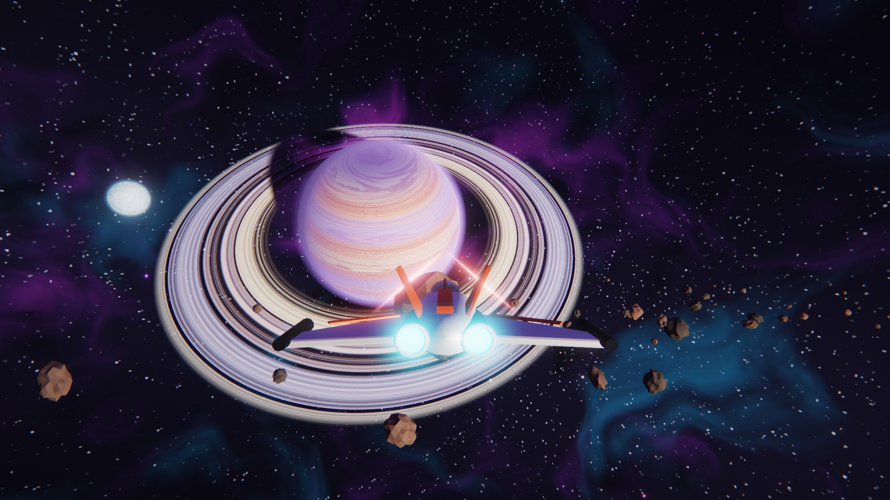
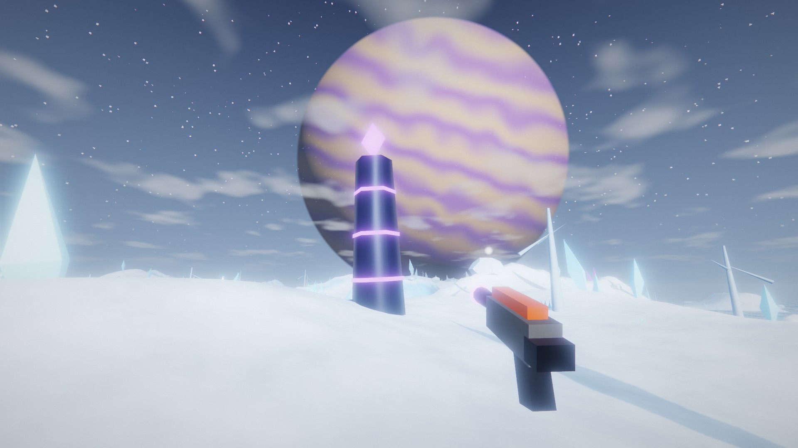
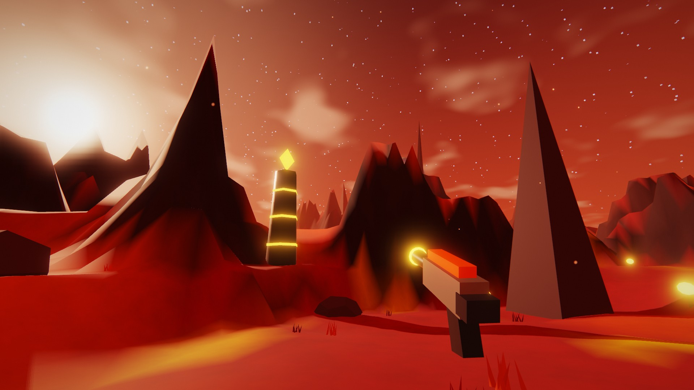

# Voidwake

*Part of [Random HTML Games](../README.md).*

A space exploration game inspired by No Man's Sky, in a single HTML file. Pulse-drive across a vast,
procedurally shaded star system of ten bodies, dive through an atmosphere, land, and mine crystal
deposits for the carbon that keeps your fuel tank alive. There are no models, textures or sound files.
Every planet, city, nebula, ship, crystal and sound is generated in code: about 5,000 lines of
JavaScript and GLSL on top of three.js r128.

**[▶ Play it](https://alekholt.github.io/random-html-games/voidwake/)** · or download `index.html` and double-click it.



## Controls

**In space**

| Input | Action |
| --- | --- |
| Mouse | Pitch / yaw (a virtual stick; the reticle shows deflection) |
| `W` / `S` | Thrust / reverse |
| `A` / `D` | Roll |
| `←` `→` `↑` `↓` | Strafe (lateral / vertical) |
| `Shift` | Boost (burns fuel fast) |
| `Space` | Engage / disengage the **pulse drive** (7,000 u/s cruise; `S` also drops out) |
| `N` | Open the **system map**: click a world for details, double-click or **Set course** to target it |
| `Tab` | Cycle the navigation target through every body |
| Hold `Q` | Turn the nose onto the navigation target |
| Hold left mouse | Mine asteroids with the wing lasers |
| `E` | Enter the atmosphere of the planet you are next to |

**On a planet**

| Input | Action |
| --- | --- |
| `WASD` · mouse | Walk and look (pointer lock) |
| `Shift` | Sprint |
| `Space` | Jump; hold to use the jetpack |
| Hold left mouse | Mining beam (watch the heat gauge) |
| `C` | Scanner pulse: tags every deposit within range |
| `E` | Board the ship and launch to orbit (costs 10% fuel), or decode a waystone |

`J` opens the survey log. `F` turns carbon into fuel anywhere: 1 C buys 2%, up to 20% per press, and you only pay for what fits
in the tank. `M` mutes. `Esc` pauses, which silences the world and ducks the music.

The system ends at the heliopause, about 944,000 u from the sun. Past the warning line, outward thrust
fades out and the ship is braked to a stop before the edge, without burning fuel against it.

### Getting around

The Halcyon Expanse is about 40 times larger than the original system. Neighbouring worlds are roughly
110,000 u apart: minutes on thrusters, about 20 seconds on the pulse drive. A typical jump:

1. Press `N`, pick a world on the map and **Set course** (or press `Tab` in flight).
2. Hold `Q` until the target bracket sits in the reticle.
3. Press `Space`. The drive charges for 1.4 s, then accelerates to 7,000 u/s. It burns 0.15% fuel a second.
4. The drive drops out on its own about two planet radii above any world you are heading into, at the
   boundary, on an asteroid strike or when the tank runs dry. From there, thrust in and press `E`.

The drive can't be engaged right next to a world, and steering is reduced while it's running. The HUD
shows the target's distance and pulse ETA.

## The loop

You start in orbit near **Eden Thalos**. Thrust drains the tank, and boost drains it fast. Carbon
comes from asteroids in space and from crystals and monoliths on the surface, and it converts into
fuel. Launching from a surface costs 10%, so on the ground you mine until you can afford to leave.
An empty tank never strands you: emergency thrusters still give 20% thrust.

### The Halcyon Survey

The goal is to survey the whole system. Fifteen objectives are tracked in the HUD's **Survey Log**;
press `J` for the full list:

- Land on each of the seven wild worlds: Eden Thalos, Sahri, Thalassa, Vharun, Umbra, Kryo-7 and
  Crysalis.
- On each, find and decode its **Ancient Waystone**, a glyph-carved obelisk with a gold light beacon that
  stands 75–125 u from the landing site. The scanner (`C`) tags it, and `E` decodes it for +30 C and a
  glyph word.
- Survey **Okara Major** by flying into close orbit (+20 C). The gas giant can't be landed on, but it
  counts.

Completing all fifteen pays a +100 C bonus.

**Progress saves automatically** in the browser (`localStorage`): carbon, fuel, worlds visited, glyphs,
the survey, stats and navigation target. It saves every few seconds, on every milestone, and when the tab closes. The
title screen shows your saved voyage, and **New voyage** (click twice) erases it. A blocked, private or
corrupt store just means a fresh start.

The system has ten bodies, from the sun outwards:

| Body | Class | Surface |
| --- | --- | --- |
| **Sahri** | Desert world | Golden dunes, sandstone arches, ribbed succulents and bone-white spires in a hot haze |
| **Eden Thalos** | Paradise world | Rolling meadows, lakes, candy-coloured canopy trees, cyan crystals |
| **Aurelia** | Core world, capital | An ultra-wealthy ecumenopolis: ivory and gold districts, park belts, reflecting lakes, gold lights at night |
| **Thalassa** | Ocean world | A turquoise ocean of small sandy islands with leaning palms and coral-crystal shores |
| **Vharun** | Toxic wasteland | Terraced crimson dunes, black spires, glowing pods, amber sludge |
| **Noctis** | Core world, undercity | A lawless, soot-dark megacity under smog, with neon that never switches off |
| **Umbra** | Twilight jungle | Permanent dusk, lit by glowing fungus trees, luminous ferns and floating spore pods |
| **Okara Major** | Ringed gas giant | No solid surface; flying into it pushes you back out |
| **Kryo-7** | Frozen moon of Okara | Snowfields, ice shards, frost trees, Okara filling the sky |
| **Crysalis** | Prismatic anomaly | Pale glass plains with iridescent spires, crystal trees and shards |

Three asteroid fields drift alongside Eden (Verdant Drift), Noctis (Kessler Reach) and Okara
(Okara Shoals).



### Trade and the city worlds

You start with 300 credits (CR) and a 24-unit cargo hold.

- **Resources.** Every wild world has its own deposit, mined like crystals but into the hold:
  - Viridium (Eden), Solanium (Sahri), Coralite (Thalassa), Sulphurine (Vharun)
  - Lumenite (Umbra), Cryonite (Kryo-7), Prismite (Crysalis)

  About one asteroid in five carries **Ferrite**, and a rare gold one carries **Aurium**.
- **Docking.** Press `E` near Aurelia or Noctis to dock, then walk the district. Press `E` at a kiosk:
  - **Trade Broker.** Sell cargo and buy fuel. Aurelia pays for luxuries (Prismite, Lumenite, Coralite,
    Aurium); Noctis pays for industry (Sulphurine, Cryonite, Solanium, Ferrite). Selling lowers a
    market's price, which recovers over a few minutes.
  - **Contracts.** Up to three jobs at a time: deliver goods, courier a sealed parcel to the other city,
    or decode a given world's waystone.
  - **Bar.** Rumours about where things sell.
  - **Black Market** (Noctis only). Neon Dust is cheap here; only a discreet buyer in Aurelia's bar
    takes it.

  - **Shipwright.** Five hulls from Phobos's lineup, each with half the old ship's price as trade-in:

    | Ship | Class | Price | Cargo | Character |
    | --- | --- | --- | --- | --- |
    | Vanta | Fighter | starter | 24 | Balanced |
    | Mule | Hauler | 16,000 | 64 | Slow, huge hold |
    | Pathfinder | Explorer | 22,000 | 36 | +20% pulse, −40% fuel use |
    | Razor | Interceptor | 30,000 (Noctis only) | 16 | +30% speed, +60% mining |
    | Solaris | Luxury yacht | 55,000 (Aurelia only) | 40 | +30% pulse, +20% speed |

    The display pad shows any hull before you buy it.
  - **Outfitter.** Eight paint jobs (200 CR), cargo pods (+8, up to two), a fuel recycler (−25% burn) and
    beam focus (+40% mining).
- **Traffic.** Freighters, shuttles, Aurelia police and Noctis interceptors circle the city worlds.
- **Saves.** Credits, cargo, contracts, your ship, its paint and upgrades are saved with the voyage.

## How it's built

**Planets** are one high-resolution sphere each, displaced in a vertex shader by 3D simplex fBm and
ridged multifractal noise. Each vertex samples the height field three times to rebuild its normal on
the tangent plane, so continents, mountains and coastlines are lit correctly. The fragment shader
colours by height, slope and latitude. Eden gets oceans with a sun glint and polar caps, Vharun
gets glowing lava basins and sulfur streaks, and Kryo gets frozen seas with fractures. The city worlds
use a latitude/longitude street grid, noise districts and highway runs, with clustered lights that come
up at dusk; Crysalis gets a view-dependent soap-film sheen. Clouds are a separate animated fBm shell.

**Atmospheres** are an analytic single-scattering shell. Each pixel intersects the view ray with the
atmosphere and planet spheres, integrates an exponential density profile across the chord with
per-sample sun visibility, and adds a Fresnel rim. The shell switches faces when you fly inside it,
so the haze also works from within the atmosphere.

**The gas giant** uses domain-warped latitude bands with differential rotation and a storm. Its
rings are four concentric `RingGeometry` bands sharing one procedural density profile, with a
Cassini-style gap. The planet casts its shadow onto the rings, and the rings cast shadows back onto
the planet.

**Scale** uses a floating origin and scaled-space rendering. Physics runs in a local frame that is
re-centred on the ship whenever it strays 4,000 u, so 32-bit GPU maths never sees large coordinates.
Bodies are drawn in scaled space: anything beyond 40,000 u is pulled toward the camera and shrunk by
the same factor, which keeps its direction and angular size exact while staying inside a modest depth
range. Each planet's lighting takes a sun direction instead of a position, so it's unaffected.

**The system map** is a 2D canvas drawn from the same orbital data: orbits, asteroid fields, the
heliopause, the ship's heading and a course line with the pulse ETA. It zooms around the cursor, and
moons and fields are pushed off their parents so they stay legible at any zoom.

**The sky** is a nebula baked once into a 1024² cubemap from fBm in neon pink, cyan and violet. On
top sit 2,000 twinkling point stars clustered along a galactic band. The same cubemap feeds a PMREM
environment map, so the ship's hull reflects the nebula.

**Planet surfaces** stream a 9×9 grid of recycled terrain tiles around you, generated on the CPU from
the same seeded noise each time. Normals come from central differences across tile borders, so
there are no seams. Flora is instanced per biome (trees, tufts, rocks, spires, glowing pods, ice
shards). Each landing spawns 15–20 mining nodes: crystals, clusters and rare glyph-banded monoliths.
The mining beam is a camera-facing ribbon from the multitool's muzzle to the raycast hit point.

**Rendering** happens in an HDR half-float multisampled target, followed by a hand-rolled 4-level
bloom, ACES tone mapping, chromatic aberration and vignette. Internal resolution scales itself down
when frames get expensive.

**Audio** is all Web Audio. The space soundtrack is a five-voice detuned-saw pad that glides between
minor-key chords (Am9 → Fmaj9 → Dm9 → Em9 → Cmaj9) through an LFO-swept low-pass filter, convolution
reverb and a delay line of sparse pentatonic plucks. Mining fires white-noise bursts through fast
exponential gain envelopes on top of a buzzing hum. Engine, wind, jetpack, footsteps and pickups
are all synthesised too.

**Scene flow** is a strict state machine
(`INTRO → SPACE_FLIGHT ⇄ ATMOSPHERE_TRANSITION ⇄ GROUND_EXPLORATION`). On landing, the ship dives on
autopilot while the screen fades to the planet's sky colour. Behind the opaque fade, the space scene
graph is disposed and the surface scene is built and pre-compiled, then the fade lifts as your ship
descends next to you.



## Running it

It's one file. Open `index.html` in any browser with WebGL2. The only network requests are three.js
r128 from cdnjs, the Tailwind CDN and two Google fonts.

```bash
python3 -m http.server 8000
```

The game needs a keyboard and mouse. If the browser never grants pointer lock (in some embedded views,
for example), mouse steering falls back to raw cursor movement. A one-off refusal after you press `Esc`
(Chrome blocks an instant re-lock) just keeps the game paused until you click again.

## Debug handles

`window.__VW` exposes the renderer, world state, input, the live `space` / `ground` scene objects, the
latest telemetry, and helpers for automation: `start()`, `land(id)`, `launch()` and `step(seconds, n)`
(a deterministic frame stepper).

## License

MIT — see [LICENSE](../LICENSE).
